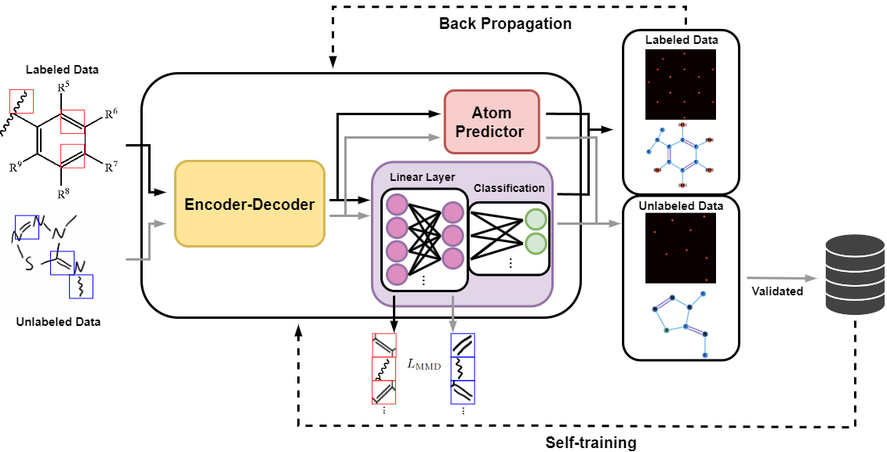

# AdaptMol: Domain Adaptation for Molecular Image Recognition with Limited Supervision



This repository contains the official implementation of our paper "AdaptMol: Domain Adaptation for Molecular Image Recognition with Limited Supervision".

## Citation

If you use our work in your research, please cite:
```bibtex
# Citation will be added upon publication
```

## Dataset

The dataset used in this work is available at: [train](https://huggingface.co/fffh1/AdaptMol/blob/main/train.tar.gz) [evaluation](https://huggingface.co/fffh1/AdaptMol/blob/main/evaluate.tar.gz)

## Pretrained Model

Download our pretrained model from: [model](https://huggingface.co/fffh1/AdaptMol/blob/main/pretrained.pth)

## Installation

### Option 1: Conda (Linux only)

```bash
conda env create -f environment.yml
conda activate adaptmol
```


### Option 2: Docker 

Make sure [Docker Desktop](https://www.docker.com/products/docker-desktop/) is installed, then:

```bash
docker-compose up --build -d
docker exec -it adaptmol bash
```


## Usage

### Inference

Run prediction on molecular images:
```bash
python predict.py --model_path checkpoints_path --image_path image_path
```

### Training

Training consists of four stages. Run them sequentially:

**Stage 1:**
```bash
bash scripts/stage1.sh
```

**Stage 2:** Generate predictions on USPTO dataset
```bash
bash scripts/predict_uspto.sh
```

**Stage 3:**
```bash
bash scripts/stage2.sh
```

**Stage 4:**
```bash
bash scripts/stage3.sh
```


## Training Script Parameters

### Common Parameters

- `--data_path`: Base directory prefix for all data file paths
- `--train_file`: Path to training data file (relative to `data_path`)
- `--validation_file`: Path to validation file, evaluated after each epoch during training
- `--test_file`: Path to test set file, used for final model evaluation after training completes
- `--valid_file`: Path to single-file validation for post-training evaluation
- `--save_path`: Directory to save model checkpoints, evaluation results, and training logs
- `--vocab_file`: Path to vocabulary file mapping tokens to characters (e.g., `adaptmol/vocab/vocab_chars.json`)
- `--molblock`: When present, model outputs both SMILES and MOL file format

### Data Format Parameters

- `--coord_bins`: Number of coordinate bins for discretization (default: 64)
- `--sep_xy`: Use separate encoding for x and y coordinates
- `--input_size`: Input image resolution (e.g., 384×384)

### Training Hyperparameters

- `--encoder_lr`: Learning rate for encoder (e.g., 4e-6)
- `--decoder_lr`: Learning rate for decoder (e.g., 4e-6)
- `--epochs`: Number of training epochs
- `--batch_size`: Batch size per GPU (automatically calculated: `BATCH_SIZE / NUM_GPUS_PER_NODE / ACCUM_STEP`)
- `--gradient_accumulation_steps`: Number of gradient accumulation steps before updating weights
- `--warmup`: Warmup ratio for learning rate scheduler
- `--label_smoothing`: Label smoothing factor to prevent overfitting (e.g., 0.1)

### Training Flags

- `--augment`: Enable data augmentation
- `--do_train`: Enable training mode
- `--do_valid`: Enable validation during training
- `--do_test`: Enable testing after training
- `--fp16`: Use mixed precision (FP16) training for efficiency
- `--use_checkpoint`: Enable gradient checkpointing to save memory

### Stage-Specific Parameters

#### Stage 2 Parameters

- `--mmd_file`: Path to hand-drawn dataset CSV file
- `--load_path`: Path to pretrained model checkpoint or previous stage model (e.g., `output/stage1/swin_base_transformer_best.pth`)
- `--resume`: Continue training from loaded checkpoint (preserves training state)
- `--init_scheduler`: Reset scheduler settings for the loaded model, including:
  - Encoder and decoder learning rates
  - Training epoch counter

#### Stage 3 Parameters

- `--finetune_data`: Path to predicted data suitable for fine-tuning (i.e. generated from Stage 2)
- `--finetune_label`: Predicted labels corresponding to `finetune_data`

### Other Parameters

- `--save_mode`: Checkpoint saving strategy (e.g., `all` to save all checkpoints)
- `--print_freq`: Logging frequency (print every N batches, e.g., 50)


## Paper Result Evaluation

To reproduce the results reported in our paper:
```bash
bash scripts/paper_evaluation.sh
```

## Acknowledgements

This work builds upon several excellent projects:

- **MolScribe**: We thank the authors for their work. Our code architecture is based on their implementation.
- **MolDepictor**: Our synthetic training data generation is based on their code with modifications.

## License

This project is licensed under the MIT License - see the [LICENSE](LICENSE) file for details.

This project includes components from third-party sources - see [THIRD_PARTY_LICENSES](THIRD_PARTY_LICENSES) for details.